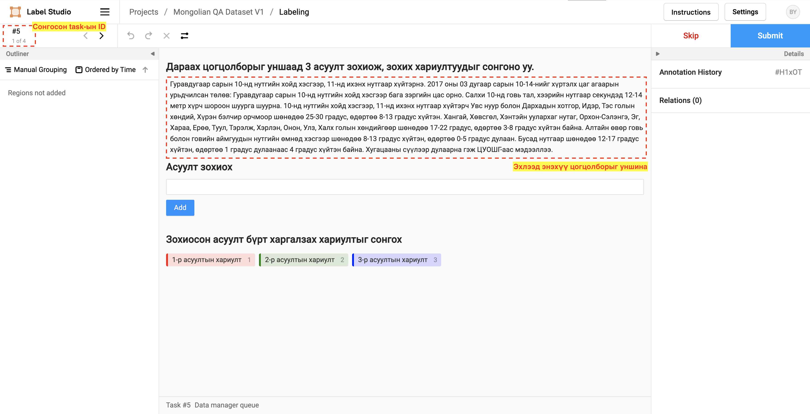
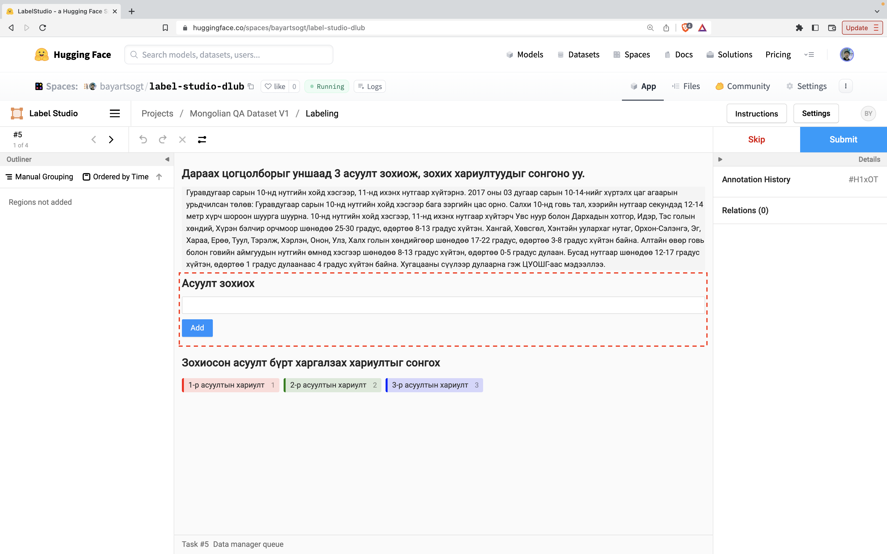

# labeling-studio-notes

## Label хийх заавар

Даалгавар:
Цогцолбороос 3 асуулт зохиож харгалцах хариултын байрыг сонгоно.

0. Анхны харагдах байдал; энэхүү цогцолборыг уншиж 3 асуулт зохиох юм.

1. Асуулт зохиох хэсэг:

2. Асуултыг бичсний дараа:

3. Нэмэгдсэн асуултыг дараа нь засах эсвэл устгах боломжтой.

4. Одоо зохиосон асуултын хариултыг сонгоход бэлдэнэ. Жишээ нь эхний асуултын хариултыг сонгохын өмнө `1-р асуултын хариулт` блокыг дарж идэвхжүүлнэ.

5. Тухайн блокыг сонгосны дараа блокын өнгө тодрох ба одоо зохиосон асуултын хариулт байгаа хэсгийг курсороо удаан дарж идэвхжүүлнэ.

6. Сонгосны дараа харагдах байдал:

7. Энэхүү үйлдлийг 3 удаа давтснаар 3 асуулт тус бүрт 3 хариулт сонгогдсон байдал:

8. Асуултын дараалал сонгосон хариулттай харгалзаж байх маш чухал.

9. Эцэст нь хариултаа "Submit" хийнэ.

